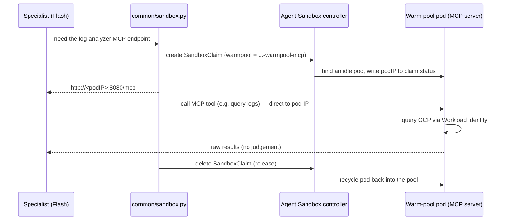

# Internal Auditor — how it all connects

A one-page map of the runtime, in plain terms. Think of the system as a
**compliance audit firm**: a lead auditor picks up requests from an inbox
tray, dispatches two junior specialists, each specialist signs out a
private sealed booth to pull data, and the lead files the combined report.

## Runtime flow

```mermaid
flowchart TD
    trigger["Cloud Scheduler cron<br/>or manual gcloud publish"] -->|"{trigger_type, lookback_hours}"| topic

    subgraph pubsub["Pub/Sub — the inbox tray"]
        topic["Topic: internal-auditor-triggers"] --> sub["Subscription:<br/>internal-auditor-triggers-sub"]
    end

    subgraph default["namespace: default"]
        orch["Orchestrator pod (Pub/Sub subscriber)<br/>Gemini Pro — the lead auditor"]
    end

    sub -->|"pulls the message"| orch

    orch -->|"tool call (parallel)"| la["log_analyzer<br/>Gemini Flash"]
    orch -->|"tool call (parallel)"| as["asset_inspector<br/>Gemini Flash"]

    subgraph agentsandbox["namespace: agent-sandbox"]
        wp1["SandboxWarmPool<br/>gcp-log-analyzer-warmpool-mcp<br/>(idle gVisor pods)"]
        wp2["SandboxWarmPool<br/>gcp-cloud-asset-warmpool-mcp<br/>(idle gVisor pods)"]
        pod1["claimed pod<br/>gcp-log-analyzer MCP server"]
        pod2["claimed pod<br/>gcp-cloud-asset MCP server"]
        wp1 -. "SandboxClaim binds one" .-> pod1
        wp2 -. "SandboxClaim binds one" .-> pod2
    end

    la -->|"claim → talk MCP → release"| pod1
    as -->|"claim → talk MCP → release"| pod2

    pod1 -->|"Workload Identity"| gcp
    pod2 -->|"Workload Identity"| gcp
    gcp["GCP APIs<br/>Cloud Logging · Cloud Asset"]

    la -->|"findings"| orch
    as -->|"findings"| orch
    orch -->|"merged report, keyed by run_id"| logs["Cloud Logging<br/>the records cabinet"]
```

## How one "booth sign-out" works (Model A: per-call claim)



The claim is created and deleted **once per tool call**. Nothing is a
web request; nothing routes through a Service — the specialist talks
straight to the bound pod's IP, then hands it back.

## The translation table

| Audit-firm analogy | Real component |
| --- | --- |
| The 9am note / a manual note in the inbox | Cloud Scheduler cron, or `gcloud pubsub topics publish` |
| The **inbox tray** (notes wait here) | **Pub/Sub** topic + subscription |
| **Lead auditor** checking the tray (not a phone) | the **orchestrator pod** — a Pub/Sub *subscriber* |
| The lead's experienced brain | **Gemini Pro** (orchestrator model) |
| Two **junior specialists** | `log_analyzer` + `asset_inspector` tools |
| The juniors' faster, cheaper brains | **Gemini Flash** (specialist model) |
| The **room of idle, pre-set-up booths** | the **warm pool** (`SandboxWarmPool`) |
| **Signing out a booth** for one task | a **SandboxClaim** (`common/sandbox.py`) |
| The booth being **sealed** | **gVisor** sandbox isolation |
| The terminal in the booth | the **MCP server** in the claimed pod |
| The terminal's **ID badge** | **Workload Identity** → GSA with read access |
| The **government archive** | **GCP** APIs (Cloud Logging, Cloud Asset) |
| **Signing the booth back in**, cleaner resets it | releasing the claim → pod recycled/replenished |
| The **records cabinet**, filed by case number | **Cloud Logging**, keyed by `run_id` |
| **Facilities/HR** who set up the lead's office | your team's **Terraform** (deploys the orchestrator) |
| The company that **built the booth room** | whoever **deployed the warm pools** |

## Two things this design deliberately does

- **Model A (per-call claim), not a shared Service.** Every tool call
  gets its own private, sealed, throwaway pod, then returns it. More
  isolation per task; the cost is the claim machinery in `sandbox.py`.
- **Subscriber, not a web server.** You drop a trigger on the queue and
  walk away — no holding a connection open while the audit runs, and if
  the orchestrator restarts, unprocessed triggers wait safely in the
  subscription.

## Who owns what (deployment)

| Owned by this repo | Owned outside this repo |
| --- | --- |
| Agent code + container image | Orchestrator Deployment (Terraform) |
| GCP setup scripts (Pub/Sub, later BQ/Firestore) | ServiceAccount + Workload Identity (Terraform) |
| The runtime env contract (`SANDBOX_*`, `PUBSUB_*`, …) | Cross-namespace SandboxClaim RBAC (Terraform) |
| — | MCP servers + their warm pools (separate) |
