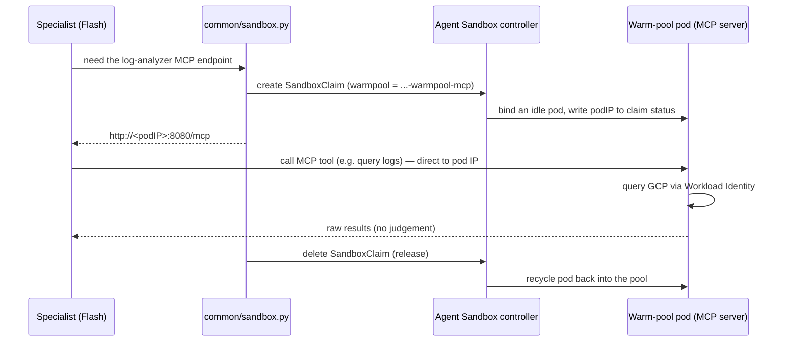

# Internal Auditor — how it all connects

A one-page map of the runtime, in plain terms. Think of the system as a
**compliance audit firm**: a client phones the front desk with an audit
request and waits on the line; the lead auditor dispatches two junior
specialists; each specialist signs out a private sealed booth to pull
data; the lead assembles the report and reads it back on the same call.

## Runtime flow

```mermaid
flowchart TD
    sched["Cloud Scheduler (cron)"] -->|"POST /run"| svc
    caller["ad-hoc / other agents"] -->|"POST /run"| svc

    subgraph default["namespace: default"]
        svc["ClusterIP Service<br/>internal-auditor-agent-svc:80"] --> orch["Orchestrator pod (adk api_server)<br/>Gemini Pro — the lead auditor"]
    end

    orch -->|"tool call (parallel)"| la["log_analyzer<br/>Gemini Flash"]
    orch -->|"tool call (parallel)"| as["asset_inspector<br/>Gemini Flash"]

    subgraph agentsandbox["namespace: agent-sandbox"]
        wp1["SandboxWarmPool<br/>gcp-log-analyzer-warmpool-mcp<br/>(idle gVisor pods)"]
        wp2["SandboxWarmPool<br/>gcp-cloud-asset-warmpool-mcp<br/>(idle gVisor pods)"]
        pod1["claimed pod<br/>gcp-log-analyzer MCP server"]
        pod2["claimed pod<br/>gcp-cloud-asset MCP server"]
        wp1 -. "SandboxClaim binds one" .-> pod1
        wp2 -. "SandboxClaim binds one" .-> pod2
    end

    la -->|"claim → talk MCP → release"| pod1
    as -->|"claim → talk MCP → release"| pod2

    pod1 -->|"Workload Identity"| gcp
    pod2 -->|"Workload Identity"| gcp
    gcp["GCP APIs<br/>Cloud Logging · Cloud Asset"]

    la -->|"findings"| orch
    as -->|"findings"| orch
    orch -->|"merged report {run_id, ...}"| svc
    svc -->|"ADK run events (final = report)"| caller
```

## How one "booth sign-out" works (Model A: per-call claim)



The claim is created and deleted **once per tool call**. Note the two
network layers: the *outer* trigger is an ADK REST call to the
orchestrator (`POST /run`), but the *inner* specialist→MCP hop routes
through **no Service** — the specialist talks straight to the claimed
pod's IP, then hands it back.

## The translation table

| Audit-firm analogy | Real component |
| --- | --- |
| The recurring 9am call / an ad-hoc caller | Cloud Scheduler cron, or an agent/human hitting ADK's `POST /run` |
| The **front desk phone line** | the **ClusterIP Service** (`internal-auditor-agent-svc:80`) |
| **Lead auditor** answering the phone, reports back on the same call | the **orchestrator pod** — served by **`adk api_server`** (synchronous) |
| The lead's experienced brain | **Gemini Pro** (orchestrator model) |
| Two **junior specialists** | `log_analyzer` + `asset_inspector` tools |
| The juniors' faster, cheaper brains | **Gemini Flash** (specialist model) |
| The **room of idle, pre-set-up booths** | the **warm pool** (`SandboxWarmPool`) |
| **Signing out a booth** for one task | a **SandboxClaim** (`common/sandbox.py`) |
| The booth being **sealed** | **gVisor** sandbox isolation |
| The terminal in the booth | the **MCP server** in the claimed pod |
| The terminal's **ID badge** | **Workload Identity** → GSA with read access |
| The **government archive** | **GCP** APIs (Cloud Logging, Cloud Asset) |
| **Signing the booth back in**, cleaner resets it | releasing the claim → pod recycled/replenished |
| The **report read back on the call** | the merged JSON in the HTTP response (keyed by `run_id`) |
| **Facilities/HR** who set up the lead's office | your team's **Terraform** (deploys the orchestrator) |
| The company that **built the booth room** | whoever **deployed the warm pools** |

## Two things this design deliberately does

- **Model A (per-call claim), not a shared Service for MCP.** Every tool
  call gets its own private, sealed, throwaway pod, then returns it. More
  isolation per task; the cost is the claim machinery in `sandbox.py`.
- **Served by `adk api_server`, in-cluster only.** ADK's standard REST
  server runs the audit synchronously and returns the result as run
  events — so cron, ad-hoc callers, and other agents all get it directly,
  the same way they call every other agent in the fleet. Exposed as a
  ClusterIP Service (no external load balancer in the path), so there's no
  LB timeout to truncate a long audit; clients just set a generous timeout.

## Who owns what (deployment)

| Owned by this repo | Owned by the `agent-spoke` Terraform module |
| --- | --- |
| Agent code (`agents/internal_auditor`) | Build (root `Dockerfile.agent` + `cloudbuild.yaml`) |
| Shared runtime (`common/`) | GSA + Vertex IAM + Workload Identity + KSA |
| The env contract passed via `env_vars` (`SANDBOX_MODE`, `MCP_NAMESPACE`, warm-pool names) | Deployment (`adk api_server`) + ClusterIP Service |
| BQ/Firestore setup (future Policy Agent) | ClusterRole/Binding for SandboxClaims + Sandbox reads |
| — | MCP servers + their warm pools (separate) |
